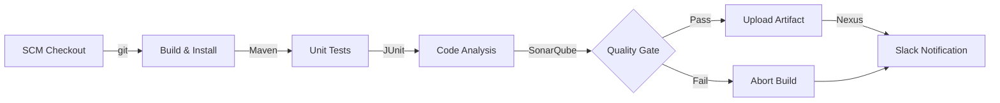

# Automated CI Pipeline for vProfile (Java Web App)

##  Project Overview
This project demonstrates a robust **Continuous Integration (CI) and Artifact Delivery** pipeline for a multi-tier Java web application ("vProfile"). 

The pipeline is defined using a **Declarative Jenkinsfile** that automates the entire software delivery lifecycle—from code checkout to artifact archiving—ensuring code quality and reliable versioning. It mimics a real-world enterprise workflow by integrating static code analysis, quality gates, and automated notifications.

##  Tech Stack & Tools
* **Orchestration:** Jenkins (Declarative Pipeline)
* **Build Tool:** Apache Maven
* **Language:** Java (JDK 17)
* **Code Analysis:** SonarQube (Static Analysis & Quality Gates)
* **Artifact Repository:** Sonatype Nexus
* **Version Control:** Git / GitHub
* **Notifications:** Slack

##  Pipeline Architecture
The pipeline executes the following workflow automatically upon every commit to the `atom` branch:

##  Pipeline Stages Breakdown

1.  **Fetch Code:**
    * Pulls the latest source code from the GitHub repository (Branch: `atom`).
2.  **Build:**
    * Compiles the Java source code and generates the artifact using `mvn install`.
    * Archives the `.war` file locally within the Jenkins workspace.
3.  **Unit Test & Checkstyle:**
    * Runs `mvn test` to validate application logic.
    * Performs `mvn checkstyle:checkstyle` to ensure adherence to coding standards.
4.  **Sonar Code Analysis:**
    * Pushes code metrics to the **SonarQube Server** to check for bugs, vulnerabilities, and code smells.
5.  **Quality Gate:**
    * **Crucial Step:** The pipeline pauses and waits for a webhook response from SonarQube.
    * If the code fails the Quality Gate (e.g., too many bugs or low test coverage), the **pipeline creates a hard stop and fails immediately**.
6.  **Upload Artifact:**
    * If all checks pass, the final `.war` file is versioned (using Build ID + Timestamp) and uploaded to the **Nexus Repository Manager** for deployment readiness.
7.  **Slack Notification:**
    * Sends a real-time alert to the `#devopscicd` channel with the build status (SUCCESS/FAILURE) and a link to the logs.

##  Prerequisites & Configuration
To replicate this pipeline, the following infrastructure setup is required:

### Jenkins Plugins
* Pipeline Maven Integration
* SonarQube Scanner
* Nexus Artifact Uploader
* Slack Notification Plugin

### Global Tool Configuration (Jenkins)
* **Maven:** `MAVEN3.9`
* **JDK:** `JDK17`
* **SonarQube:** `sonar6.2` (Scanner)

### Environment Variables
The `Jenkinsfile` relies on the following credentials and endpoints configured in Jenkins:
* `sonarserver`: The ID for the SonarQube server configuration.
* `nexuslogin`: Jenkins Credentials ID for Nexus authentication.
* `slack-token`: (Implicit) Token for Slack integration.

##  Future Improvements
* **Containerization:** Dockerize the application for consistent runtime environments.
* **Orchestration:** Deploy the artifact to a Kubernetes cluster using Helm charts.
* **Infrastructure as Code:** Provision the Jenkins and Nexus servers using Terraform.
